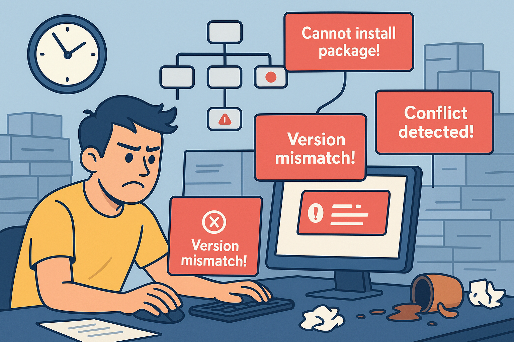
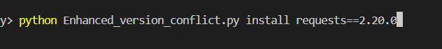
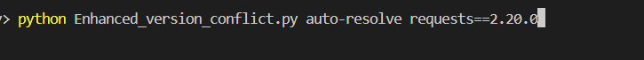

# SynapFix

While working on software projects, I noticed that a huge amount of development time is wasted on **dependency conflicts**, **version mismatches**, and broken builds. These issues are especially common in Python projects, where packages depend on different versions of the same libraries. Debugging these conflicts is tedious, error-prone, and often requires manually checking dependency chains. This inspired the creation of **SynapFix**, an AI-powered dependency intelligence system designed to **detect, predict, and resolve conflicts automatically**, making installations smooth and error-free.

SynapFix is implemented as a **Python CLI tool** that integrates **agentic AI** to detect conflicts. The AI backend uses **Gemini API** for intelligent version resolution and **Auth0** for secure authentication and API access. It allows developers to make informed decisions about which versions to install or lets the AI auto-resolve conflicts safely. Each action is logged for transparency, ensuring accountability during dependency management.


---

## How SynapFix Works

1. **Dependency Graph Construction**  
   When a package installation is initiated, SynapFix scans the requested package and its dependencies, building an internal **dependency graph**. This graph tracks each package, its required version, and its dependencies’ versions, providing a clear picture of potential conflicts.

2. **Conflict Detection**  
   SynapFix identifies **version mismatches** in the graph, such as two packages requiring incompatible versions of the same library. It marks these as conflicts and determines which packages are causing cascading errors.

3. **AI-based Resolution**  
   The agentic AI model suggests versions compatible with other install packages and provides the optimal resolution.  
   - **Auto-resolve option:** Applies the AI’s suggested versions automatically.  
   - **Manual suggestion mode:** Displays recommended versions for the developer to approve.  
   - **Agentic AI Backend:** Uses **Gemini API** for intelligent decision-making and version resolution.  

4. **Secure API & Auth (Auth0)**  
   SynapFix uses **Auth0** for authentication and secure API access:  
   - **Token Management:** Short-lived tokens that automatically refresh, cached locally at `~/.mycli/token.json` to avoid repeated logins.  
   - **Secure API Calls:** All calls to **Gemini API** (or future APIs) include `Authorization: Bearer <token>`.  
   - **Audit & Logging:** Auth0 tracks who called which API, helping monitor AI suggestions and user behavior.  

5. **Audit Logging**  
   Every installation, conflict detection, suggestion, and resolution is recorded in a **log file**. This ensures transparency and traceability for all actions taken by SynapFix. Over time, these logs also help the AI model improve its accuracy and decision-making.

---

## Key Features

- **Automatic conflict detection** during package installations.  
- **Version suggestions** if there are version conflicts.  
- **Agentic AI** capable of autonomously resolving conflicts while giving users control.  
- **Gemini API integration** for intelligent AI-based decision-making.  
- **Auth0-secured API access** for all CLI operations.  
- **CLI-based interface** for quick, terminal-based operations without leaving the workflow.  
- **Audit logging** for full transparency and accountability.  
- **Learning and adaptation** to improve accuracy over time.  
- **Modular architecture** allowing future integration with AI advisors, cloud APIs, or package management enhancements.

---

## How to Use

- Install a specific package version:  
```bash
python Enhanced_version_conflict.py install <package_name> <version>  # or only <package_name>

``` 

- If version conflict exist then Auto-resolve 

```bash
python Enhanced_version_conflict.py auto-resolve <package_name> <version>  # or only <package_name>

``` 
You can find the demo the project in the below link:
- [View Demo](https://youtu.be/VcprNGYaR3M) - Try yourself out

## Examples

- Example commands are illustrated in the images below:

- **Install a package:**  
  

- **Auto-resolve if a version conflict exists:**  


